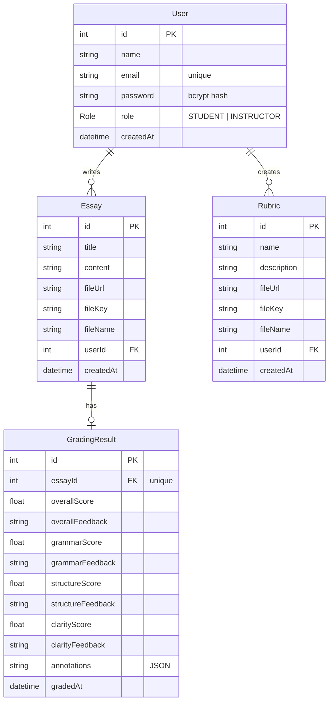

# Final Project – Web Application Development and Security
Course Code: COMP6703001

Course Name: Web Application Development and Security

Institution: BINUS University International

---
## Project Information
Project Title: **EasyEssays**

Project Domain: **Interactive-Essay-Grading**

Class:  **[COMP6703001] B4AC**

Group Members:
    
    o Jerico, 2802521112, Team Lead, JericoTj
    o YiYang, 2802542924, Backend, TT1264
    o Heraisya, 2802536442 , Frontend & Documentation, mumeiphoric
---
## Instructor & Repository Access

• **Instructor: Ida Bagus Kerthyayana Manuaba**

    o Email: imanuaba@binus.edu
    o GitHub: bagzcode

• **Instructor Assistant: Juwono**

    o Email: juwono@binus.edu
    o GitHub: Juwono136

---
## Project Overview
### Problem Statement
• This application is meant as an alternative and an easier way one can review, check or even check an essay or numerous essays in a single application

• The target audiences for this applications are both students and lecturers/teachers  

### Solution Overview
• Main features that this app holds are the ability to check Essays from Grammar, Essay Format, AI checker , plagiarism checker and Grading such Essays

• This solution is appropriate as it allows all the thing students/teachers want to check in a single website

• AI is used to identify plagiarism, Grammar, Format, and Checking Originality from AI

---
## Technology Stack

| Layer            | Technology |
| ---------------- |:----------:|
| Frontend         | **Next.js 15 (App Router) + React 19 + Tailwind CSS 4** |
| Backend          | **Next.js API Routes (Node.js 20)** |
| API              | **REST API (OpenAPI / Swagger documented)** |
| Database / ORM   | **PostgreSQL via Prisma ORM** |
| Authentication   | **JWT (jsonwebtoken) + bcrypt password hashing** |
| File Storage     | **Cloudflare R2 (S3-compatible, via AWS SDK)** |
| AI / NLP         | **Groq SDK — Llama 3.3 70B Versatile** |
| Text Extraction  | **pdf2json (PDF), mammoth (DOCX), UTF-8 (TXT)** |
| Containerization | **Docker + docker-compose** |
| Deployment       | **Vercel (production); Docker / Nixpacks supported** |
| CI               | **GitHub Actions (build check)** |
| Version Control  | **GitHub** |

---
## System Architecture
### Architecture Diagram
```
                         ┌─────────────────────────────────────────────┐
                         │            Next.js Application              │
                         │             (Modular Monolith)              │
   ┌──────────┐          │  ┌──────────────┐      ┌──────────────────┐ │
   │ Browser  │  HTTPS   │  │  Frontend    │ fetch│   API Routes     │ │
   │ (React + │ ───────► │  │  (App Router │─────►│   /app/api/*     │ │
   │ Tailwind)│ ◄─────── │  │  dashboards) │      │  auth/essays/    │ │
   └──────────┘   JSON   │  └──────────────┘      │  rubrics/upload  │ │
                         │                        └────────┬─────────┘ │
                         │                                 │           │
                         │        ┌────────────┌───────────┼           │
                         │        ▼            ▼           ▼           │
                         │  ┌──────────┐ ┌──────────┐ ┌───────────┐    │
                         │  │ Prisma → │ │ Groq LLM │ │Cloudflare │    │
                         │  │PostgreSQL│ │(Llama3.3)│ │   R2      │    │
                         │  └──────────┘ └──────────┘ └───────────┘    │
                         └─────────────────────────────────────────────┘
```

### Architecture Explanation
**Frontend ↔ API ↔ Database interaction**
        
- Next.js (App Router) and React are used to create the frontend. Dashboard pages use fetch to call internal REST endpoints found at /app/api/*, sending the JWT in the Authorization header as a Bearer token.
        
- For each called API route, the JWT is validated, authorization is enforced, business logic is executed, and the Prisma client talks to PostgreSQL. Specifically, file bytes are sent to Cloudflare R2, and the AI tasks are sent to Groq.
        
- As a Modular Monolith, all the modules (auth, essays, rubrics, upload, grading, file extraction) are packed and deployed as a single application. However, despite being a single application, these modules are encapsulated to provide a scalable and maintainable application.
        
**Separation of concerns**
- app/api/* — HTTP routing, auth checks, and shaping the request/response
  
- lib/ — services: db.ts (Prisma client), auth-server.ts (token verification + role checks), r2.ts (object storage), extract.ts (document → text), rate-limit.ts, swagger.ts
  
- prisma/ — schema and migrations

- app/dashboard/* and components/ — UI

**Where security is enforced**
- Via verifyToken / role checks for each protected route

- Login rate limiting (lib/rate-limit.ts)

- File-type and size checks for uploads

- Security response headers configured in next.config.ts

- DB, JWT, R2, Groq secrets stored as environment variables

---
## API Design
### API Endpoints

| Method | Endpoint                  | Description                                    | Auth Required |
| ------ | ------------------------- | ---------------------------------------------- | ------------- |
| POST   | `/api/auth/login`         | Login to the system                           | No            |
| POST   | `/api/auth/register`      | Create an account                             | No            |
| GET    | `/api/docs`               | View API Docs                                | No            |
| GET    | `/api/essays`             | View all essays                              | Yes           |
| POST   | `/api/essays`             | Submit an essay                              | Yes           |
| GET    | `/api/essays/[id]`        | View an essay                               | Yes           |
| GET    | `/api/essays/[id]/content` | View an essay's content                     | Yes           |
| POST   | `/api/essays/[id]/grade`  | Grade an essay using a rubric               | Yes           |
| GET    | `/api/rubrics`            | View all rubrics                            | Yes           |
| POST   | `/api/rubrics`            | Create a rubric                             | Yes           |
| GET    | `/api/rubrics/[id]`       | View a rubric                              | Yes           |
| POST   | `/api/rubrics/[id]/extract`| Extract rubric criteria from the content   | Yes           |
| POST   | `/api/upload`             | Upload essays or rubrics to the system     | Yes           |

### API Documentation
    
• **Swagger UI:** available at https://interactive-essay-grading-fp.vercel.app/docs (also at /docs when running locally; hosted with swagger-ui-react)
        
• **OpenAPI spec:** available at /api/docs (swagger-jsdoc, see lib/swagger.ts)
    
• **Postman:** see .postman/ and postman/ in the repo

**Example request — Register**
```
POST /api/auth/register
Content-Type: application/json

{
  "name": "Jane Student",
  "email": "jane@binus.ac.id",
  "password": "S3curePass!",
  "role": "STUDENT"
}
```

**Response — 201 Created**
```
{
  "id": 7,
  "name": "Jane Student",
  "email": "jane@binus.ac.id",
  "role": "STUDENT",
  "createdAt": "2026-06-16T07:30:00.000Z"
}
```

**Example request — Login**
```
POST /api/auth/login
Content-Type: application/json

{ "email": "jane@binus.ac.id", "password": "S3curePass!" }
```

**Response — 200 OK**
```
{ "token": "eyJhbGciOiJIUzI1NiIsInR5cCI6...", "role": "STUDENT" }
```

**Example request — Grade an essay**
```
POST /api/essays/12/grade
Authorization: Bearer <token>
Content-Type: application/json

{ "rubricText": "Thesis clarity 30%, evidence 40%, mechanics 30%" }
```

**Response — 200 OK** (persisted GradingResult)
```
{
  "id": 4,
  "essayId": 12,
  "overallScore": 82,
  "overallFeedback": "A clear argument with solid support; tighten the conclusion.",
  "grammarScore": 88,
  "grammarFeedback": "Minor comma splices in paragraph two.",
  "structureScore": 80,
  "structureFeedback": "Strong intro; transitions between body paragraphs are abrupt.",
  "clarityScore": 78,
  "clarityFeedback": "Some sentences are overlong and bury the main point.",
  "annotations": "[{\"sentence\":\"...\",\"issue\":\"clarity\",\"suggestion\":\"...\"}]",
  "gradedAt": "2026-06-16T07:35:00.000Z"
}
```

---
## Database Design

### Database Choice
We opted for PostgreSQL (managed through the Prisma ORM) for several reasons:

• Data is sharply relational, with users possessing multiple essays and rubrics, and every essay contains one grading result. This is ideal for foreign key and one-to-one relationship mapping.

• PostgreSQL utilizes a typed schema and enforces referential integrity, which fits graded academic records.

• Using Prisma allows safe and typed queries, migration management, and a more seamless transition from local development to production. Firebase was bypassed due to our in-house JWT + bcrypt authentication.

### Schema / Data Structure



---

## AI Features

### AI Feature List
| AI Feature | Purpose | AI Type |
| ---------- | ------- | ------- |
| Rubric-aligned essay scoring | Produces an overall score (0–100) plus grammar, structure, and clarity sub-scores with written feedback. If a rubric is supplied, the model grades against that rubric's criteria. | NLP (LLM text understanding & evaluation) |
| Writing annotation | Identifies the most important writing issues sentence-by-sentence and returns each as { sentence, issue, suggestion } so the writer sees exactly what to fix. | NLP (LLM text generation) |
 
Both features run on Groq using the Llama 3.3 70B Versatile model, called with temperature: 0.3 and response_format: json_object to keep output structured. Document text extraction (pdf2json / mammoth) is a supporting pipeline that turns uploaded files into the text these features consume.

### AI Integration Flow
1. The text of the essay is the primary input. In the absence of text, a file will be downloaded from R2, and the text will be extracted. It will be cached to the database. Text from the rubric may also be provided.
2. Two independent AIs will be prompted simultaneously. One will be asked to grade and provide feedback (possibly via the rubric), while the other will be asked to list the major issues with writing in an essay.
3. The resultant strict JSON to be graded and annotated will be returned to the front end.

**How AI results are used in the system**
- The grading dashboard and the results view of the essay will display feedback and grading.
- Inline editing suggestions are a result of the rendered JSON.
- Since the GradingResult for each essay is unique, results for each graded essay are consistent and clear.

---
## Security Implementation
**Authentication (JWT)**
- Once users register, their passwords are no longer kept in plaintext. Instead, passwords are stored in user registration with bcrypt hashing (cost of 10).
- Upon successful sign in, a user is given a signed JWT (jsonwebtoken) which includes userId and role and is good for 1 hour.
- JWT token is required in the authorization header as a Bearer <token> request, and verifyToken will discard tokens that are malformed, missing, and expired.

**Authorization (roles)**
- There are 2 roles in the application (that is, STUDENT and INSTRUCTOR).
- Students are limited to seeing and grading only their individual essays. (Grading verification is also scoped by userId).
- Creating a grading rubric is limited to users with the INSTRUCTOR role, whereas all others (403 Forbidden) are also limited.

**Input validation**
- Validation for email occurs on registration and login with regular expression for formatting.
- Other validations include ensuring data is provided for user title, content, grading rubric name, and that user role requests are sent with defined roles. Undefined roles default to STUDENT.
- Additionally, requests are limited to PDFs, DOCXs, and TXTs with a limit of 10MB.


**Protection against common attacks**
- SQL Injection is prevented since all database queries go through Prisma, which does only parameterized queries.
- XSS is also prevented since the default behavior for rendered output in React is escaped. Additionally, security headers are implemented in next.config.ts (X-Content-Type-Options: nosniff, X-XSS-Protection).
- To protect against CSRF and Clickjacking, token-based APIs are utilized along with session that doesn’t require a forged cookie. X-Frame-Options: DENY along with a strict-origin-when-cross-origin Referrer-Policy are set in response headers.
- Brute force protection measures include a login attempts limit of 10 within 60 seconds (rate-limiter-flexible) for each IP.

**Secure API key handling**
- All secrets are read only from their environment variables (including DATABASE_URL, JWT_SECRET, GROQ_API_KEY, and R2 credentials).
- There shall be no tracking of .env* files in git and production secrets will be in the secret store of the deployment platform.
    
---

## Testing Documentation 


---
# Deployment & Production Setup
### Docker Setup
- A Dockerfile is included which contains a multi-stage build based on node:20-alpine (builder → runner) and exposing port 3000.
- A docker-compose.yml is included which runs the app in conjunction with a Postgres:16-alpine database with a healthcheck and a persistent volume.
- A docker-compose.dev.yml is included which spins up just a local Postgres for development.

Just run it locally with Docker using:
```bash
docker compose up --build
```

### Production Environment
```
DATABASE_URL			 # PostgreSQL connection string
JWT_SECRET			     # secret for signing/verifying JWTs
GROQ_API_KEY			 # Groq API key (Llama 3.3 70B)
R2_ACCOUNT_ID			 # Cloudflare R2 account id
R2_ACCESS_KEY_ID		 # R2 access key
R2_SECRET_ACCESS_KEY	 # R2 secret key
R2_BUCKET_NAME			 # R2 bucket
R2_PUBLIC_URL			 # public base URL for stored files

```

**Secrets handling**
- Simply stored as environment variables and as platform secrets. .env* is git ignored.
- No secrets are committed to the repository.

**HTTPS configuration**
- TLS/HTTPS is automatically handled by the hosting platform (Vercel).
- Security headers (X-Frame-Options, X-Content-Type-Options, X-XSS-Protection, Referrer-Policy) are configured for all routes by next.config.ts.

### Live Application URL
**https://interactive-essay-grading-1411417ci-jericotjs-projects.vercel.app**

---

### GitHub Contribution Summary

**Jerico (2802521112)**

Jerico was a Team Lead and managed the development and architectural design of applications. He supported the development of features for user authentication, essay moderation, and dashboards. He was involved in the creation and testing of API (Application Programming Interface) endpoints, assisted in the implementation of Protected Routes, and supported the development of the AI-enabled essay grading tool.

**YiYang (2802542924)**

YiYang was involved in backend development, including the setup and configuration of databases, Docker, and deployment. He participated in the development and testing of APIs, deployment security, and assisted in the development of features for AI-enabled grading and rubric extraction.

**Heraisya (2802536442)**

Heraisya was involved in frontend development and the construction of dashboards and features for file upload and management of rubrics and essays. He supported the development of APIs and their documentation, the design and testing of databases, the verification of deployments, and authentication. He also supported project documentation, the integration of AI-assisted grading, and the integration of AI-assisted grading workflows

---

## AI Usage Disclosure

ChatGPT (OpenAI) and Claude (Anthropic) were used for drafting and documenting improvements scaled up efforts to improve code, configurations, and Docker and deployment procedures. This included API efforts. Other tools helped prepare and document project efforts and record necessary tests. These tools were also useful for error handling.

---

## Known Limitations & Future Improvements

**Current limitations**
- Improvements are not permanent after the first evaluation (outputs are unalterable for each improvement).
- Per-instance rate limitations reset upon system restart.
- JWTs were left in local storage to be summoned quicker at the expense of added security, unlike HttpOnly cookies.
- The quality of text extraction is dependent on the quality of the source (scanned text PDFs still retain their quality because of the lack of OCR).
- An automated test suite has not been built; the tests rely on integration checks from CI.


**Possible future enhancements**
- Removal of the per-instance rate limitation.
- Authorize instructor intervention to adjust AI scores, allow hierarchical grading, and view grading history.
- Enable OCR for scanned documents.
- Session tokens placed in HttpOnly cookies with refresh tokens.
- An automated test suite (unit, integration, end-to-end) is built.

**AI limitations and risks**
- AI tools may carry biases from the training set.
- Annotations from AI may miss the mark during critical evaluations, thus a review by a human is still recommended.

---
## Final Declaration

We declare that:

    • This project is our own work
    • AI usage is disclosed honestly
    • All group members understand the system

Signed by Group Members:

Jerico

Yiyang

Heraisya

---
# SETUP
## Deployment Instructions

**Requirements:** Node.js 20, npm 10+, PostgreSQL, Cloudflare R2, Groq API

1. **Clone & install**
   ```bash
   git clone <repo-url>
   cd Interactive-Essay-Grading-FP
   npm ci
   ```

2. **Configure environment**
   ```
   Create a .env file with  Production Environment  variables.
   ```

4. **Database**
   ```bash
   npx prisma migrate deploy   # applies the migrations
   npx prisma generate
   ```
   Local Development requires a database of:
   ```bash
   docker compose -f docker-compose.dev.yml up -d
   ```

5. **Start in Development**
   ```bash
   npm run dev
   ```
   Access at `http://localhost:3000`.

6. **Start in Production**
   ```bash
   npm run build
   npm start
   ```

7. **(Optional) Start with Docker**
   ```bash
   docker compose up --build
   ```

While the app is running, access the API Documentation at /docs (Swagger UI) or /api/docs (Open API JSON).
